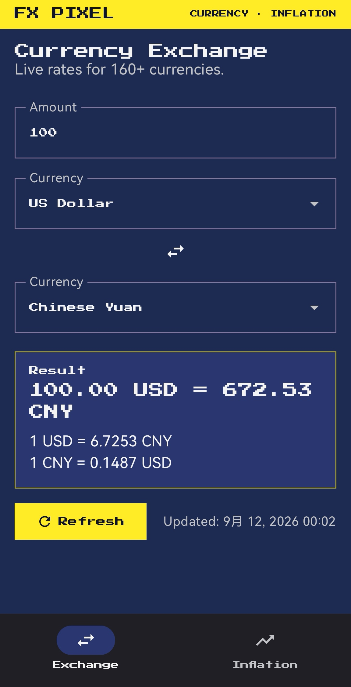
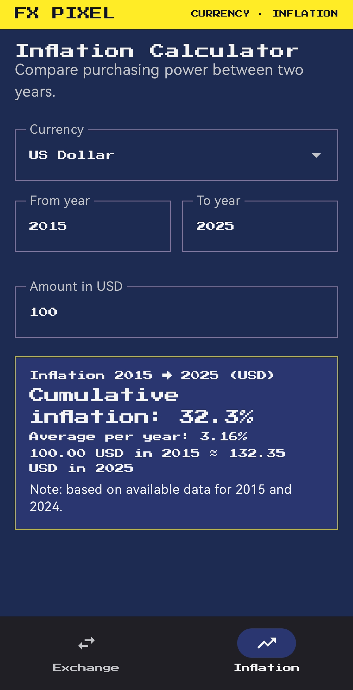

# FX Pixel（货币换算与通胀计算）

[**English**](README.md) | [**中文版**](#)


注重隐私的安卓应用：全球货币实时汇率 + 任意年份之间的通货膨胀计算，采用复古像素主题。

## 界面截图

| 汇率换算 | 通胀计算 |
|---|---|
|  |  |

## 功能

- **汇率换算**：160+ 种货币的实时汇率（open.er-api.com，免费、无需密钥）
- **通胀计算**：使用世界银行 CPI 数据，比较任意两年（1990–2026）之间的购买力
- **购买力对比**：如 2015 年的 100 美元 ≈ 2025 年的多少钱，含累计通胀率与年均通胀率
- **货币搜索**：按代码或名称快速查找
- **复古像素主题**：PICO-8 配色、Press Start 2P 像素字体（OFL 许可）
- **无广告、无跟踪、无账号**：仅 INTERNET 权限，全 HTTPS

## 数据源

| 来源 | 数据 | 许可/密钥 |
|---|---|---|
| [open.er-api.com](https://www.exchangerate-api.com/docs/free) | 实时汇率（166 种货币） | 免费，无需密钥 |
| [World Bank API](https://data.worldbank.org/indicator/FP.CPI.TOTL) | 年度 CPI（2010 年 = 100） | 免费，无需密钥 |

说明：
- 世界银行没有发布欧元区的 CPI 指数。应用自动回退到年度通胀率序列并重建指数，
  比值计算（累计通胀、购买力）仍然精确。
- 最新年份的数据往往尚未发布；应用使用最近可用的数据点。
- CPI 数据本地缓存 7 天；网络不可用时自动回退到最近一次缓存的数据。
- 无可用世界银行 CPI 数据的货币（TWD、CUP、SOS、TMT、ERN、XOF 等）不会出现在通胀页。

## 构建

要求：JDK 17+、Android SDK 35。

```bash
./gradlew assembleDebug
# APK 路径: app/build/outputs/apk/debug/app-debug.apk
```

### 安装到手机

方式 1 — 从 GitHub Release 下载（已签名 APK）：

1. 打开 https://github.com/xieguaiwu/currency-transfer/releases
2. 下载 **FX-Pixel-v1.0.0.apk**（已签名）并打开
3. 若有提示，允许文件管理器/浏览器"安装未知应用"

方式 2 — 手机开启 USB 调试后：

```bash
# 一键脚本（推送到 /sdcard/Download/）
./scripts/push-apk-to-phone.sh

# 或 adb 直接安装
adb install -r app/build/outputs/apk/debug/app-debug.apk
```

F-Droid 发布准备中（见下方 F-Droid 章节）。

## 测试

```bash
./gradlew testDebugUnitTest
# 单元测试：通胀计算、货币表、API 响应解析
./gradlew lintDebug
# Android Lint：0 错误，0 警告
```

## 截图（Paparazzi）

UI 渲染由 Paparazzi 生成（JVM，无需真机）：

```bash
./gradlew testDebugUnitTest --tests "com.xieguiawu.currencytransfer.AppScreenshotsTest"
# PNG：app/build/reports/paparazzi/debug/images/
```

## 隐私与安全

- 唯一权限：INTERNET（获取汇率与 CPI 所需）
- 无遥测、无广告、无统计
- 通过 network security config 阻止明文 HTTP，仅系统 CA
- 禁用云备份与设备迁移（不持久化数据）
- 本地不存储任何数据；请求直接发往公开数据源

安全政策见 [SECURITY.md](SECURITY.md)。

## F-Droid / 发布

- `fastlane/metadata/`：双语商店元数据（en-US、zh-CN）
- `scripts/verify-reproducible.sh`：可复现构建验证（已在 tag v1.0.0 实测通过）
- `docs/fdroid/com.xieguiawu.currencytransfer.yml`：fdroiddata 元数据草稿（反特性：NonFreeNet）

## 贡献

见 [CONTRIBUTING.md](CONTRIBUTING.md)。

## CI

推送或 PR 到 master 会触发 GitHub Actions：单元测试、Android Lint、release APK 构建。

## 许可证

MIT — 见 [LICENSE](LICENSE)。
